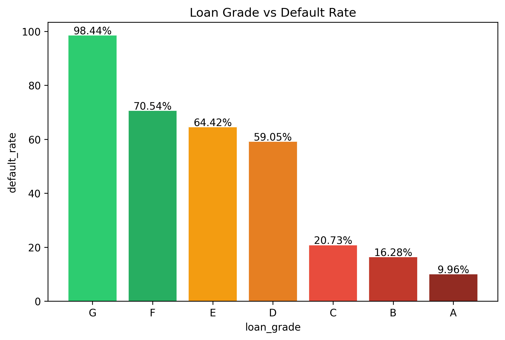
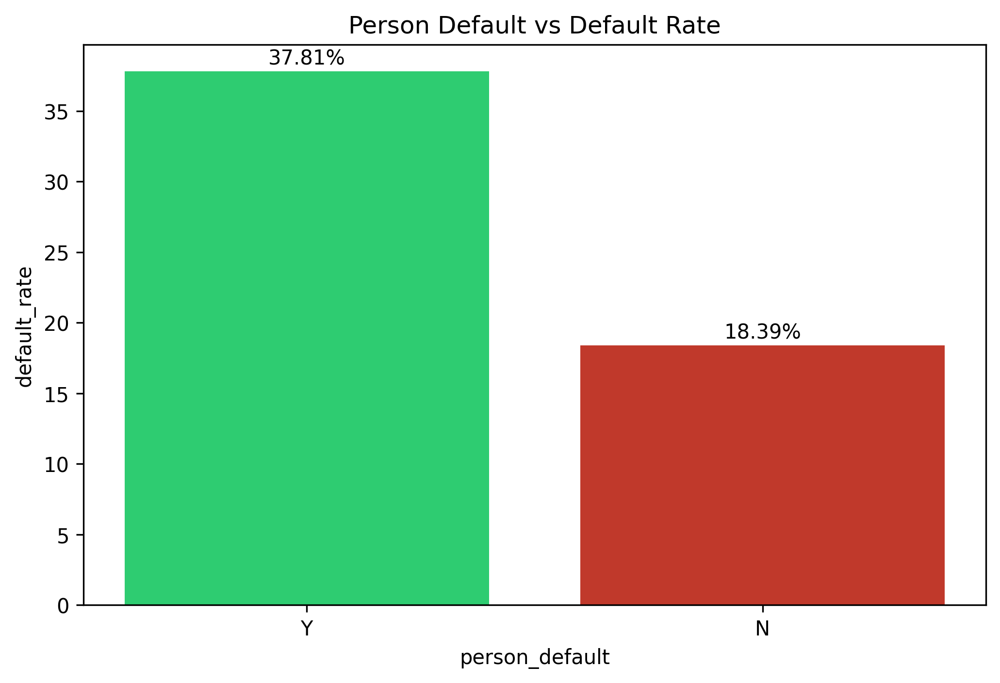
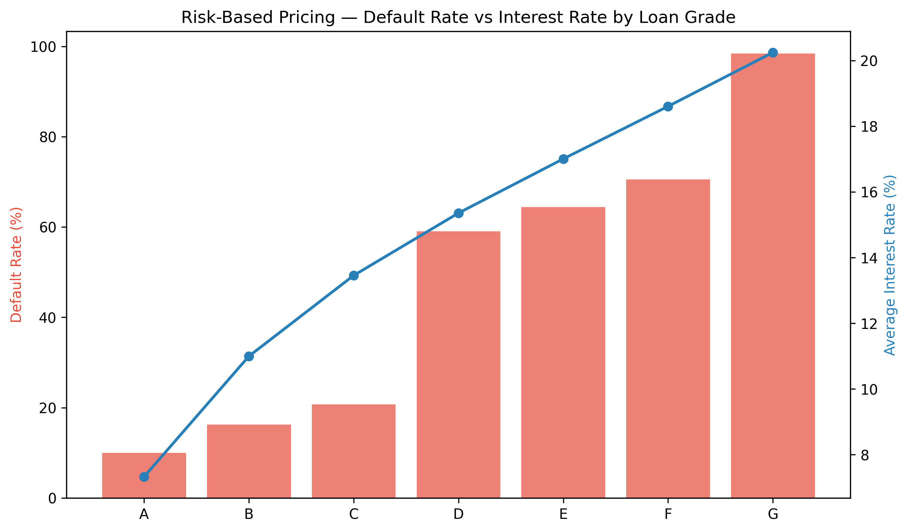

# 🏦 Banking Credit Risk Analysis — SQL & Python


> A comprehensive credit risk analysis project using SQL & Python on 32,000+ loan records — identifying key default drivers and their implications for risk management, internal audit, and IFRS 9 compliance.

---

## 📌 Project Overview

This project combines **5+ years of financial audit experience** (RSM Indonesia & Amar Bank) with data analytics to analyze credit risk patterns in a real-world lending dataset.

As someone who has worked on **PSAK 71/IFRS 9 implementation** in financial institutions, this analysis bridges the gap between audit domain knowledge and data-driven insights.

**Key Question:** *What factors drive loan default, and how can banks use this data to strengthen their risk management framework?*

---

## 📊 Dataset

| Item | Detail |
|------|--------|
| Source | [Credit Risk Dataset — Kaggle](https://www.kaggle.com/datasets/laotse/credit-risk-dataset) |
| Rows | 32,581 records |
| Columns | 12 features |
| Target Variable | `loan_status` (0 = Non-Default, 1 = Default) |

### Features Description

| Column | Description |
|--------|-------------|
| `person_age` | Age of the borrower |
| `person_income` | Annual income |
| `person_home_ownership` | Home ownership status |
| `person_emp_length` | Employment length (years) |
| `loan_intent` | Purpose of the loan |
| `loan_grade` | Loan risk grade (A to G) |
| `loan_amnt` | Loan amount |
| `loan_int_rate` | Interest rate |
| `loan_status` | Default status (0/1) |
| `loan_percent_income` | Loan as % of income |
| `cb_person_default_on_file` | Previous default history (Y/N) |
| `cb_person_cred_hist_length` | Credit history length (years) |

---

## 🎯 Business Questions & Key Findings

### BQ1 — Overall Default Rate
> *"What is the overall default rate in this portfolio?"*

**Finding:** 21.82% of borrowers defaulted — a significantly high rate that would require substantial ECL provisioning under IFRS 9.

---

### BQ2 — Default Rate by Loan Intent
> *"Which loan purpose carries the highest default risk?"*

| Loan Intent | Default Rate |
|-------------|-------------|
| Debt Consolidation | Highest |
| Venture | Lowest |

**Finding:** Debt consolidation borrowers carry the highest default risk — likely because they are already in financial distress before applying.

---

### BQ3 — Default Rate by Loan Grade
> *"Is loan grade a reliable predictor of default?"*

**Finding:** Strong linear relationship confirmed — Grade A has the lowest default rate while Grade G exceeds 50%. Loan grade is a **highly reliable** risk predictor.



---

### BQ4 — Impact of Default History
> *"Do borrowers with prior default history pose significantly higher risk?"*

| Default History | Default Rate |
|-----------------|-------------|
| Yes (Y) | 37.18% |
| No (N) | 18.39% |

**Finding:** Borrowers with prior default history are **2x more likely** to default again — a critical early warning indicator for credit assessment.



---

### BQ5 — Default Rate by Income Level
> *"How does income level affect default probability?"*

| Income Category | Default Rate |
|-----------------|-------------|
| Low (< 30K) | 45.53% |
| Middle (30K–80K) | 21.22% |
| High (> 80K) | 9.40% |

**Finding:** Low-income borrowers default at nearly **5x the rate** of high-income borrowers — income is a strong predictor of repayment capacity.

---

### BQ6 — Risk-Based Pricing Validation
> *"Has the bank correctly priced interest rates according to risk?"*

**Finding:** Risk-based pricing is confirmed — interest rates increase consistently from Grade A to Grade G, appropriately compensating for higher default risk.



---

### BQ7 — Credit History Length
> *"Does longer credit history reduce default risk?"*

| Credit History | Default Rate |
|----------------|-------------|
| Short (< 5 years) | Highest |
| Medium (5–15 years) | Moderate |
| Long (> 15 years) | Lowest |

**Finding:** Longer credit history correlates with lower default rates — experienced borrowers are more reliable in managing debt obligations.

---

## 💡 Business Implications

### 🏦 Risk Management & Credit Team
Default patterns by grade and income level provide a stronger foundation for **credit scoring models** and limit-setting policies. Banks can use these insights to tighten approval criteria for high-risk segments.

### 📋 Internal Audit & Compliance
Prior default history is a significant early warning indicator that can **strengthen risk-based audit procedures** and help identify high-risk borrowers earlier in the process.

### 📈 Finance & IFRS 9 Team
Default distribution by customer segment supports more accurate **Expected Credit Loss (ECL)** calculations — directly impacting the adequacy of provisions and the quality of financial reporting.

---

## 🛠️ Tools & Technologies

| Tool | Usage |
|------|-------|
| Python (Pandas) | Data manipulation & SQL execution |
| SQLite | Database storage & SQL queries |
| SQL | Business questions & aggregations |
| Matplotlib | Data visualization |
| Seaborn | Enhanced chart styling |
| Jupyter Notebook | Analysis environment |

---

## 📊 SQL Concepts Applied

| Concept | Usage |
|---------|-------|
| `SELECT, WHERE, ORDER BY` | Basic data retrieval |
| `SUM, COUNT, AVG, ROUND` | Aggregation functions |
| `GROUP BY, HAVING` | Grouping and filtering |
| `CASE WHEN` | Income & credit history categorization |
| Subquery | Dynamic filtering |
| CTE (`WITH`) | Multi-step analysis |
| Window Functions | `RANK()`, `LAG()` |

---

## 📁 Repository Structure

```
banking-credit-risk-analysis/
│
├── notebook/
│   └── credit_risk_analysis.ipynb   # Main analysis notebook
│
├── images/
│   ├── default_rate_overview.png
│   ├── default_by_loan_grade.png
│   ├── default_by_history.png
│   └── risk_based_pricing.png
│
├── data/
│   └── credit_risk_dataset.csv      # Raw dataset
│
└── README.md
```

---

## 🚀 How to Run

1. Clone this repository
```bash
git clone https://github.com/ApriandiM/banking-credit-risk-analysis.git
```

2. Install required libraries
```bash
pip install pandas matplotlib seaborn jupyter
```

3. Open Jupyter Notebook
```bash
jupyter notebook notebook/credit_risk_analysis.ipynb
```

4. Run all cells sequentially

---

## 🔮 Next Steps

- [ ] Build a **predictive model** (Logistic Regression / Random Forest) to predict default probability
- [ ] Implement **IFRS 9 staging** classification (Stage 1, 2, 3) based on risk factors
- [ ] Develop an **Expected Credit Loss (ECL)** calculation model
- [ ] Build an interactive dashboard using **Power BI**

---

## 👤 Author

**Apriandi Manurung**
- 📧 Email: apriandimanurung@gmail.com
- 💼 LinkedIn: [linkedin.com/in/apriandi-manurung](https://linkedin.com/in/apriandi-manurung)
- 🐙 GitHub: [github.com/ApriandiM](https://github.com/ApriandiM)
- 🌐 Portfolio: [Notion Portfolio](#)

---

*If you found this project insightful, feel free to ⭐ star this repository!*
